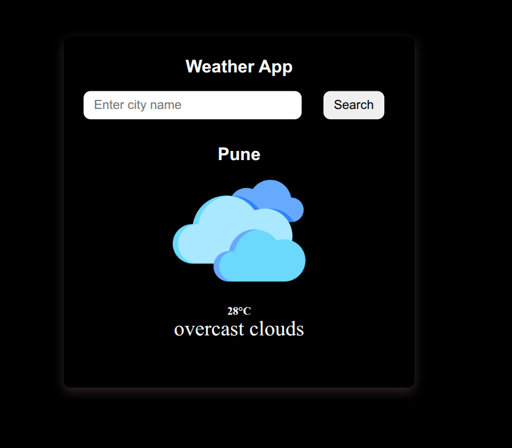

# 🌤️ React Weather App

A sleek and responsive weather application built with **ReactJS**. It allows users to:

- Search weather by city name
- Automatically fetch weather using your current location
- View temperature, weather condition, and icon in a beautiful UI

---

## 🚀 Features

- 🔍 Search by City
- 📍 Auto-fetch weather using Geolocation
- 🌡️ Displays temperature in °C
- 🌥️ Shows weather condition and matching icon
- ❌ Error handling for invalid city names and denied location access
- ⚡ Fast and responsive UI

---

## 📸 Preview

 <!-- Add your own screenshot -->

---

## 🌐 Live Demo

👉 [Click here to try the app](https://weather-api-react-rosy.vercel.app/)

---

## 🛠️ Tech Stack

- ReactJS (Functional Components + Hooks)
- Vite (for fast bundling and development)
- OpenWeatherMap API
- CSS (or Tailwind, if used)
- HTML5 + JS

---

## 📦 Setup Instructions

1. **Clone the repository**
   ```bash
   git clone https://github.com/your-username/react-weather-app.git
   cd react-weather-app
Install dependencies

bash
Copy
Edit
npm install
Set up your environment variable
Create a .env file in the root directory and add your OpenWeatherMap API key:

env
Copy
Edit
VITE_API_KEY=your_api_key_here
Run the development server

bash
Copy
Edit
npm run dev
Build for production

bash
Copy
Edit
npm run build
🌍 API Used
OpenWeatherMap API

📱 Responsive Design
Works seamlessly on:

📱 Mobile

💻 Desktop

📟 Tablets

🧩 Folder Structure
bash
Copy
Edit
src/
│
├── assets/              # Weather icons/images
├── components/          # (if you separate components)
├── Weather.jsx          # Main weather component
├── App.jsx
├── main.jsx
└── index.css
🙌 Contribution
Contributions are welcome! Feel free to fork the repo and submit a pull request.

⚖️ License
MIT License

💡 Author
Made with ❤️ by Your Name
